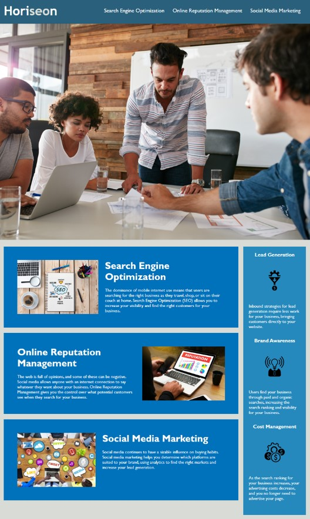

# Business Generator

## Description

This app is a clone assignment. Using only basic HTML and CSS. The assignment focused on changing HTML to correct semantic
elements. Links are primarily functional and correctly navigate users to the appropriate destination in the body. I had to change CSS so that each section will match with HTML code. For example: Header is in the Nav bar section and you can see in CSS code the Nav.

## Installation

There was no installation for this app. I had to clone the repo that was already done.

## Usage

## Links

[Deployed site](https://lexxvasquez.github.io/HoriseonHw/)

[Github](https://github.com/Lexxvasquez/HoriseonHw)
